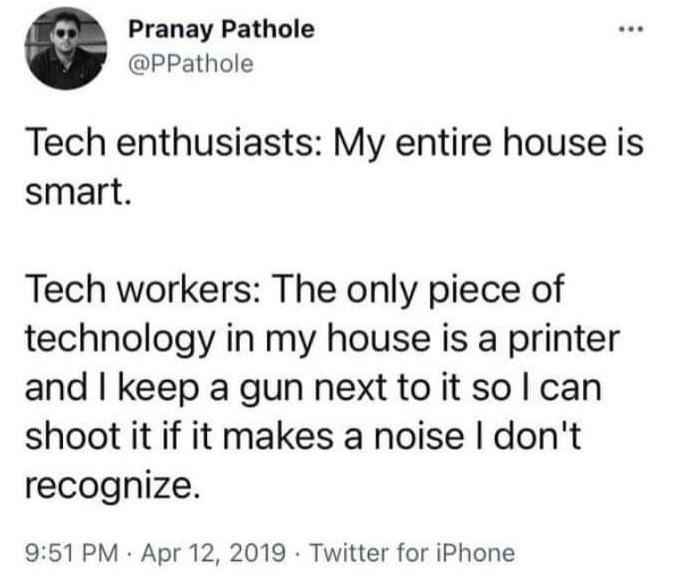
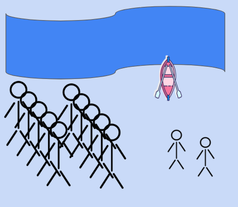
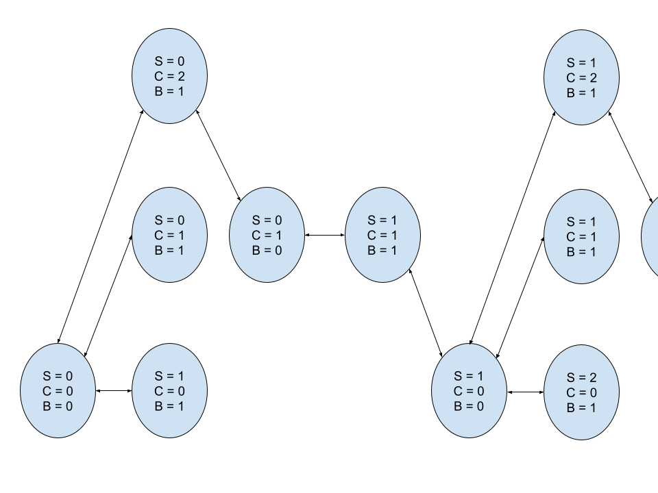

# Why Study Computer Science Today?

It's 2026. AI coding tools are everywhere. Large companies are laying off thousands of software engineers. Some people even think that in a few years, no one will need to know how to program computers, as AI tools will allow anyone to create anything they can imagine with a series of English prompts. 

Why should anyone bother going through the difficult and troublesome process of learning to code today? And why would anyone want to major in computer science if it is not a guaranteed ticket to a high paying job?

While I think these concerns are overblown (software engineers are not going away any time soon), they point towards a fundamental misunderstanding of computer science, and the point of a computer science education, which really hasn't changed.

So why do I (as a computer science professor) think you should study computer science? I think there are three really good reasons:

### You Have a Love-Hate Relationship with Technology

One of the defining features of computer scientists, in my experience, is that they have two seemingly contradictory qualities:

* Deep skills for "figuring out" digital tech
* A dislike and distrust for the design of consumer tech products

I have a memory of a computer science class I took in college where my professor couldn't get Microsoft Word to open on his Mac. So he opened the terminal, entered a series of commands to show the list of processes on his computer, get their process IDs and memory usage, and then kill and reopen Word. Muttering swear words, he went on to open the document he wanted to show us.

Many computer scientists dislike technology because they understand that some limitations of digital technology are due to technical constraints and others are due to design decisions. However, they understand when products are too complicated for their own good, or are just poorly made. We yearn for technology that is simple, efficient, customizable, transparent and easy to fix. From this perspective, AI (and all of the interesting things downstream from it) is very similar to many other technologies. It is opaque, doesn't always work as intended and fails for confusing reasons.

Today, these sorts of concerns can involve even bigger social issues as well. Image generators are putting commercial artists out of work. Social media algorithms are encouraging all sorts of mental health problems and shaping politics. Governments are using digital technology to surveil everything and everyone. The tech industry is producing half-baked technological solutions to problems that don't necessarily benefit from them. Hackers are using defects in technology to steal sensitive information and hold critical business and government systems ransom.

If you really want to like new technology, but can't, either because you are concerned about these consequences or because you just want the tech industry to do better, computer science might be a good major for you.

### You Want to Know How Stuff Works

Computers and their programs are very complicated. But, through the power of abstraction and interfaces, ordinary people can use them every day without understanding exactly what happens when you tap an app icon on your phone, enter a search in your web browser, ask a chatbot a question or look up directions on a maps app.

But haven't you ever wondered how those sorts of things work?

In computer science, we pull back the curtain and ask how all of the parts of the computer really work. We learn how to build these sorts of things ourselves from scratch. The point of doing this is not to actually build a better operating system or networking protocol, but to understand as deeply as possible how these things work, predict their behaviors and find the root cause of complex problems.

This is where computer science begins to look more like a science. You are attempting to build your understanding of how computers work so that you can better predict their behavior and design other software around them. 

The difference between computer science and something like biology or chemistry is that (at least until recently) a human had to design every part of a computer and its software, and we know how to read the code and specifications. So every scientific question you can think of about computers has a right answer that we can actually figure out.

### You Love Puzzles and Games

Computer science, at its heart, is not actually about computers. It is really about problems, and how we can solve them systematically. We teach problem-solving using puzzles, since they're much more fun than real-world business problems. For example:

* Ten soldiers and two children sit on the side of a river. 
* The children have a boat that can fit either one or two children, or one adult, without sinking. The boat is not magic, and needs at least one person in it to go across the river.
* Can you figure out a way to get all of the soldiers to the other side?

When you hear those instructions, you may not immediately know what to do. But if you play around with the pieces a bit (I give this puzzle to intro programming students along with some bits of paper), you'll realize there is a simple sequence of moves, repeated once per soldier, that solves the puzzle:

* Send two children across to the far side.
* Have one child bring the boat back.
* Send the boat across with a soldier.
* Have the remaining child bring the boat back.
* Repeat these steps 10 times.

I also give this problem in my upper-level AI class. The students in this class are not just responsible for solving the problem, they have to formalize the problem mathematically and draw it using a state space diagram. In this case, we can define the state of the puzzle by the number of soldiers, children and boats on the far side of the river, (S,C,B). The first state is (0,0,0), as all of the people are on the near side of the river to start. From there, we can figure out all of the legal moves in the puzzle and draw them, with arrows representing legal moves.

Once you see the problem as a graph, it is clear not just how to solve the problem, but how easy it is. There are no dead ends, as every possible move is reversible, and all of the wrong answers go nowhere.

This is the essence of computer science. We take a puzzle, play with it a bit, figure it out thoroughly and then write the solution as an algorithm. Computers serve to help us figure out whether our solutions are right. These skills are very transferrable and help you learn to solve all sorts of real-world problems.

### Some reasons you might not want to study computer science

I love computer science and believe that anyone can benefit from learning it. That said, computer science is not the right major for everyone. Here are some situations in which you may want to consider other majors:

* **You don't like being confused:** Many students find computer science difficult because it tends to put you in situations where you are confused and won't know what to do at first. Maybe you have a homework problem that seems impossible and you don't know where to start. Maybe there's a bug in your code that you just can't figure out. That discomfort *is* the point of computer science assignments, and there is no way to avoid it. Over time, you get used to that feeling and learn how to figure things out.
* **You struggle with arithmetic:** Computer science *is* math. We do a lot of routine arithmetic and use a lot of math concepts in our programs. That said, high school math mostly comes into computer science on a conceptual level. We don't sit around solving algebra or calculus problems.
* **You want to work with real, physical things:** If you want to work in a lab with physical objects, you may be a better fit in a different science or engineering degree. CS is very abstract and, while we love to play with physical objects when exploring problems, most of our work is on a whiteboard or on the computer.

## A Theme

Something you may have noticed: in each of these examples, programming is a means to an end. Having working code serves as a way to demonstrate understanding, but the code itself isn't particularly valuable without that understanding. It is, in so many ways, like writing.

This is why I don't think AI means the end of computer science, or the jobs that demand computer science degrees. It may seem, from outside, like software engineers and other people with technical jobs are paid to write code, but they are really paid to solve problems and express the solutions in code.